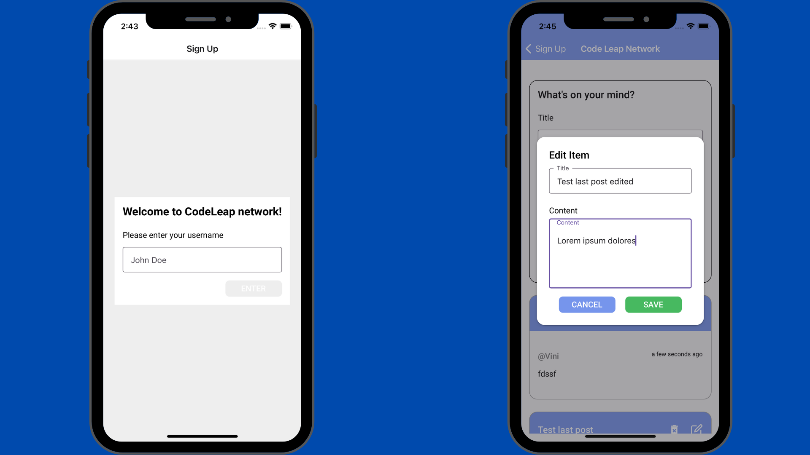

# CodeLeap React Native App

## Table of Contents
- [Installation](#installation)
- [Usage](#usage)

## Code Leap

Codeleap is an app that was created for testing purpose for Code Leap company.

The project contains simple CRUD operations, a sign up modal at the first screen.

## Installation

To install Codeleap App, you can follow these steps:

#### npm

1. Clone the repository onto your local machine: `git clone git@github.com:alanhcrdz/codeleap-test.git`
2. Run `npm install` to install the necessary dependencies
3. Run `npx expo start` to start the app

#### yarn

1. Clone the repository onto your local machine: `git clone git@github.com:alanhcrdz/codeleap-test.git`
2. Run `yarn install` to install the necessary dependencies
3. Run `npx expo start` to start the app
4. Open with a connected device or use Android/iOS simulators on your local machine

## Usage

Once you've installed Codeleap test app, you can use it to:

- View a list of posts added by users and yourself.
- Create your own post with a title and content
- Edit your own posts
- Delete your posts

